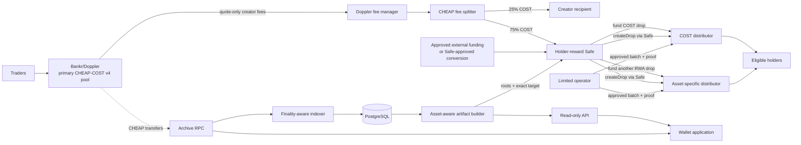

# CheapCoin architecture

Status: production foundation, pre-deployment. Last verified: 2026-08-11.

## System boundary

Bankr/Doppler owns the token launch, primary pool, and creator-fee accounting.
The public `CheapFeeSplitter` is the single beneficiary of the CHEAP/COST pool
and calls the verified pool fee manager directly. CheapCoin owns holder
accounting, reward-asset registration, streaks, exclusions, published artifacts,
batch execution, partner benefits, deal discovery, and the application.

Canonical COST is an already-deployed quote asset. Its own deployment beneficiary
is unrelated to the CHEAP/COST pool and is never configured or controlled by
CheapCoin. Only the beneficiary for the new CHEAP launch is set to the splitter.

## Multi-RWA model

A single Uniswap pool has one quote asset. The planned primary market remains
CHEAP/COST with `quoteOnlyFees: true`, so the direct creator-fee share arrives in
COST. Supporting additional RWA rewards does not require, and should not begin
with, several CHEAP pools.

Instead, each approved RWA token receives its own non-upgradeable distributor:

- the distributor's reward token is immutable;
- its reserves, pause state, operator, commitments, and remediation are isolated;
- every artifact names the reward token and exact distributor target;
- the public registry must match Robinhood's current canonical token registry;
- a token becoming inactive blocks new drops without affecting other assets.

Additional reward assets can be funded by an executed partner program, a direct
treasury deposit, or a separately approved treasury conversion. COST creator
fees are never represented as another asset until that conversion is completed
and verified. One primary pool plus several isolated reward rails avoids
liquidity fragmentation and keeps each payout auditable.

## Onchain components

### `CheapFeeSplitter`

- Primary quote token, creator recipient, holder Safe, and 25/75 split are immutable.
- The owner is a multisig Safe, not an application key.
- Doppler fee manager and pool ID are configured once after launch verification.
- Anyone may trigger collection; funds can reach only the immutable recipients.
- The primary quote token cannot be swept as an unsupported token.
- It intentionally does not route CHEAP. Community airdrops and scheduled burns
  use a separately disclosed CHEAP vault allocation and Safe transaction flow.

### `CheapBatchDistributor`

- One deployment holds one immutable, canonical reward token.
- A distributor holds only pre-funded value reserved for its own drops.
- The Safe commits the allocation root, exact batch root, amount, and batch count.
- Any operator change to a recipient or amount fails Merkle proof verification.
- Wallet and batch replay are prevented; reserved funds cannot be withdrawn.
- Partial failure uses the seven-day paused Safe remediation path.
- Adding an RWA means deploying another instance, not upgrading an existing one.

## Offchain components

### CHEAP transfer indexer

The indexer reads only the new Robinhood Chain CHEAP `Transfer` logs from its
verified launch block. Before cursor creation it verifies chain ID 4663 and
deployed code at the configured CHEAP address. It uses finalized blocks by
default. The cursor stores its block hash, latest observed finalized target, and
last check time. Readiness fails while backfilling or stale. A hash mismatch
rebuilds raw history and marks unfinished work for remediation. No payout private
key exists in the service.

### Holding windows

The worker reconstructs the balance before each window and replays transfers in
order. The lowest CHEAP balance, not the ending balance, is the payout base. A
wallet first receiving CHEAP mid-window begins with a zero minimum and can
qualify in the following window.

### Asset-aware artifacts

The builder uses bigint arithmetic and creates:

1. a public per-wallet allocation commitment;
2. a root of the exact execution batches approved by the Safe;
3. the canonical reward-asset metadata and immutable distributor target;
4. the exact published rules path and SHA-256 digest for the holding window;
5. Safe and operator transaction objects for batches of at most 200 wallets.

Production evidence uses the immutable v3 JSON Schema. Public CI applies that
schema, independently recomputes allocations, roots, proofs, and calldata, and
checks a linked reconciliation fixture before accepting live records.

The same holding window may fund zero, one, or several asset-specific drops.
Each drop has a unique ID and independent funding.

### Community contribution scoring

The public protocol package can score a pre-approved set of committed community
events using versioned flat points and daily/round caps, allocate an explicitly
funded community pool, and merge overlapping holder/contributor payouts. X OAuth,
wallet-link verification, consent, source retrieval, anti-Sybil review, and
appeals remain private service responsibilities. The holder-only v3 artifact is
not changed; activation requires a new public schema and shadow round.

### Wallet application

The application reads ETH, CHEAP, and registered RWA balances from Robinhood
Chain. Eligibility, the reward-asset registry, and finalized drop history come
from the read-only API. Preview content is never promoted to live state.

## Data ownership

| Datum | Authority | Display source |
|---|---|---|
| CHEAP and RWA balances | Robinhood Chain | RPC / wallet client |
| Primary creator fees | Doppler contracts | Bankr reads + RPC |
| Canonical RWA identity | Robinhood asset registry + pinned address | Registry monitor + database |
| CHEAP transfer history | CHEAP contract logs | Indexer/PostgreSQL |
| Window rules and exclusions | Exact published bytes and SHA-256 | Database + v3 artifact |
| Allocation and batch roots | Deterministic artifact | Immutable storage + distributor |
| Paid status | Asset-specific distributor | RPC/indexer |
| Partner terms | Executed, published record | Application API |

The database is never final payment authority. Artifact, distributor target,
token balance, roots, events, and batch transactions must reconcile.

## Deliberate V1 exclusions

- No Solana migration or legacy allocation.
- No upgradeable contracts or backend custody.
- No automatic treasury swaps or autonomous asset selection.
- No fragmented CHEAP liquidity pools for every reward asset.
- No fabricated APY, guaranteed payout, or fixed drop schedule.
- No staking emissions or LP attribution until separately funded and audited.
