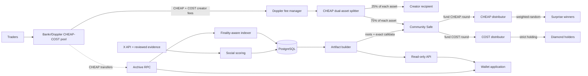

# CheapCoin architecture

Status: production foundation, pre-deployment. Last verified: 2026-08-12.

## System boundary

Bankr/Doppler owns the launch, primary pool, and creator-fee accounting. The
public `CheapFeeSplitter` is the sole CHEAP launch fee beneficiary and routes
both pool assets. CheapCoin owns holder accounting, social evidence review,
weighted selection, streaks, exclusions, artifacts, batch execution, partner
benefits, and the wallet application.

Bankr is an optional transaction interface, not the Diamond Drop or Surprise
Drop control plane. Recipient selection and exact amounts remain independently
reproducible without Bankr.

## Two independent reward programs

### COST Diamond Drops

- Eligibility comes only from CHEAP transfer history.
- The wallet must start at or above the fixed floor and make no outbound CHEAP
  transfer during the hidden-end window.
- Published duration bounds plus a future finalized Robinhood block select the
  hidden end reproducibly after the longest possible window has elapsed.
- Any outbound transfer disqualifies that window and resets the next streak.
- Eligible weight is the window's minimum CHEAP balance times the streak multiplier.
- Every eligible wallet receives its deterministic share of the funded COST budget.
- Social activity never changes COST eligibility or payout weight.

### CHEAP Surprise Drops

- Eligibility requires both an approved social contribution minimum and the
  published CHEAP holding floor.
- Capped activity points times capped holding units create selection weight.
- A future finalized block hash, committed before it is known, seeds weighted
  sampling without replacement.
- Winner count stays below eligible candidate count, so no wallet is guaranteed.
- Selected wallets share only the fixed, pre-funded CHEAP budget.

Pre-launch activity creates a Genesis record only. It may enter the first
post-launch candidate calculation under pre-published rules once the wallet also
holds CHEAP.

## Onchain components

### `CheapFeeSplitter`

- Canonical COST, creator recipient, community Safe, and 25/75 split are immutable.
- CHEAP token, Doppler fee manager, and pool ID are configured together once
  after launch verification.
- Anyone may collect and split; both CHEAP and COST can reach only the immutable
  recipients.
- Neither pool token can be swept. Unsupported-token recovery is disabled before
  pool configuration.
- The owner is a multisig Safe, never an application key.

### `CheapBatchDistributor`

- One deployment holds one immutable token, so CHEAP and COST use separate instances.
- The Safe commits the allocation root, batch root, amount, and batch count.
- Any operator modification fails proof verification.
- Recipient and batch replay are prevented; reserved funds cannot be withdrawn.
- Partial failure uses the seven-day paused Safe remediation path.

## Offchain components

### CHEAP transfer indexer

The indexer reads the new Robinhood Chain CHEAP `Transfer` logs from the verified
launch block with finalized-block tracking and reorg detection. For every Diamond
window it records the starting, minimum, and ending balance plus whether the
wallet emitted any outbound transfer. New mid-window recipients start at a zero
minimum and can first qualify in the following window.

### Social evidence service

The private service links an X account to a wallet through provider OAuth and a
short-lived domain-bound wallet signature. It retains commitments, timestamps,
consent evidence, and review results, not OAuth tokens or public usernames in the
ledger. Likes, reposts, follows, replies, views, impressions, and passive Space
listening are analytics-only. TikTok remains display/analytics-only until its
applicable platform policy permits reward scoring.

### Public artifacts

Every funded distribution commits its exact rules bytes and digest, candidate or
holder decisions, budget, reward token and distributor, allocation root, batch
root, proofs, and calldata. Surprise artifacts additionally publish the frozen
candidate commitment, precommitted future entropy block, finalized block hash,
seed, weighted draws, and exact winners. No raw social identity data is public.

### Wallet application

The app reads ETH, CHEAP, and registered RWA balances from Robinhood Chain. It
shows Diamond eligibility and Surprise odds as separate states, clearly labels
preview data, and never asks for token approval merely to view records.

## Multi-RWA model

The primary pool has one quote asset: COST. Additional RWA rewards use separate
immutable distributors funded through a disclosed partner deposit or Safe-approved
conversion. They do not create extra CHEAP liquidity pools. Each asset is checked
against the current canonical registry before a new campaign.

## Data authority

| Datum | Authority | Display source |
|---|---|---|
| CHEAP and RWA balances | Robinhood Chain | RPC / wallet client |
| Creator fees | Doppler contracts | Bankr reads + RPC |
| CHEAP holding history | CHEAP transfer logs | Indexer / PostgreSQL |
| Social contribution evidence | Provider API + review commitments | Private service |
| Rules, candidates, randomness, allocations | Versioned public artifact | Public ledger |
| Payment state | Asset-specific distributor | RPC / indexer |
| Partner benefits | Executed published terms | Application API |

The database is never final payment authority. Artifact, token, distributor,
roots, events, and transaction receipts must reconcile.

## Deliberate V1 exclusions

- No Solana migration or legacy allocation.
- No upgradeable contracts or backend custody.
- No automatic treasury swaps or autonomous asset selection.
- No raw social engagement-count rewards.
- No fabricated APY, guaranteed payout, or fixed drop schedule.
- No staking emissions or LP attribution until separately funded and audited.
